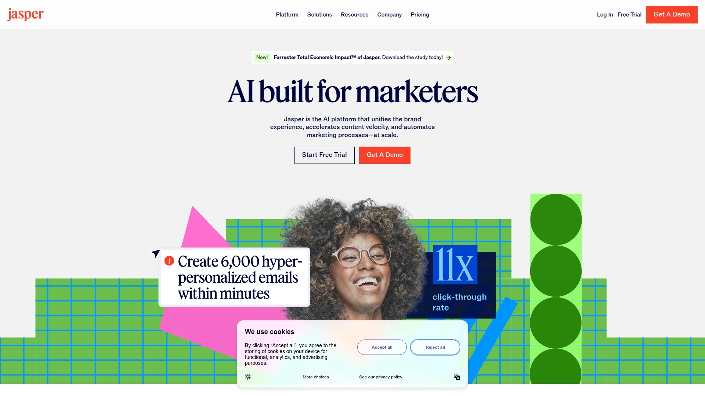

# Top 12 AI Ad Creative Generation Tools in 2025 (Recently Updated)

Running ads is exhausting when you're stuck staring at blank canvases, hiring expensive designers for every variation, or watching your creative output bottleneck while competitors flood feeds with fresh content. AI ad generators solve the speed problem by turning simple prompts into scroll-stopping visuals in seconds, but quality varies wildly. The best platforms balance automation with customization, letting you scale creative production without sacrificing brand consistency or performance. Here's what actually works when you need to generate ad creatives that convert, not just exist.

***

## **[AdCreative.ai](https://www.adcreative.ai)**

The platform that turns URL inputs into complete ad campaigns with predictive scoring to tell you which creatives will perform before you spend a dollar.

AdCreative.ai dominates the AI advertising space because it handles the entire creative workflow from a single dashboard. You input your website URL, and the system analyzes your brand to generate ad banners, product photoshoots, and video ads optimized for conversion. The standout feature is Creative Scoring AI, which predicts performance with over 90% accuracy so you know which ads to push budget toward.

For small businesses drowning in manual design work, the Instant Ads feature scans webpages to produce high-performing advertisements automatically. The tool intelligently creates detailed buyer personas from your website data, helping you refine targeting without guesswork. Pricing starts at $39 monthly for 10 creative downloads on the Starter plan, scaling to $249 monthly for 100 downloads on the Professional tier. Users consistently mention time savings, with one noting "it helps generate high-converting creatives in minutes". The platform integrates with Meta, Google, LinkedIn, and includes access to iStock imagery. Best for e-commerce brands and agencies juggling multiple campaigns who need performance predictions upfront.

***

## **[Canva](https://www.canva.com)**

AI design suite combining Magic Studio tools with drag-and-drop simplicity for marketers who want creative control without design school.

Canva transformed from template library to AI powerhouse with Magic Studio, a collection of intelligent features that automate tedious design tasks. Magic Design generates complete ad layouts from text prompts or uploaded logos, creating dozens of branded social posts instantly. The AI doesn't just make pretty pictures—Magic Morph transforms text into textured graphics like balloon letters or neon signs, while Magic Animate adds motion to static designs without manual keyframing.

What makes Canva different is accessibility. The platform feels intuitive whether you're a solo creator or enterprise team, with AI enhancement tools that automatically adjust image brightness and contrast. Magic Media lets you generate images and videos from text descriptions, then immediately pull them into the editor for refinement. The free plan includes basic AI features, while Canva Pro unlocks advanced capabilities starting around $15 monthly per user. Background removal, auto layout adjustments, and intelligent color suggestions work seamlessly in the flow of design. Teams appreciate the collaborative workspace and ability to maintain brand consistency across thousands of assets. Ideal for content creators and small businesses who want professional results without hiring designers.

***

## **[Pencil](https://trypencil.com)**

Enterprise-grade ad platform that generates, tests, and launches video and static ads across major channels with AI predictions built for scale.

Pencil targets brands and agencies managing high-volume campaigns, having produced over 1 million AI-generated ad creatives for 5,000+ companies worldwide. The platform uses multiple AI models including Runway and Stability to create complete ads—not just images, but scripts, voiceovers, and multi-format variations. Boston Consulting Group partnered with Pencil specifically because their clients saw a 40% performance uplift while cutting production costs by 62%.

The workflow covers five stages: Get Content, Scale Content, Edit, Collaborate & Launch, and Understand Impact. Real-time feedback helps you adjust creatives based on AI recommendations before launch. Template variety spans industries and campaign goals, while automated testing identifies top performers automatically. Pencil's enterprise features include brand safety controls, data ringfencing, and direct integrations with Facebook, Google Display, Instagram, TikTok, and YouTube. The platform recently integrated Adobe Firefly Services for seamless access to creative tools. Pricing details require consultation, signaling this tool is built for serious budgets. Companies like Amplifon and Lancel showcase significant improvements in case studies. Perfect for marketing teams that need industrial-strength creative production with compliance requirements.

***

## **[Creatopy](https://www.creatopy.com)**

Multi-channel ad automation platform that turns website URLs into ready-to-deploy ad sets with live editing capabilities for deployed campaigns.

Creatopy solves the multi-platform headache by generating ad designs for various formats from one interface, then letting you update live creatives without pausing campaigns. The AI Design Generator pulls content from your landing page URL and creates multiple sizes optimized for different platforms instantly. For teams drowning in resizing tasks, the magic resizer adapts designs across social networks with one click.

The platform shines with animation features—an Animated Text Maker transforms static copy into motion graphics using hundreds of built-in effects. Creatopy's video editor creates HTML5 animated ads that stand out in crowded feeds. Brand management tools store assets so every design stays consistent, while collaboration features let teams and clients share feedback in real-time. Ad automation scales production using data feeds and integrations with Zapier and Shopify. The AI generates images, text, and translations to streamline workflows. Pricing starts at $36 monthly when billed annually. Marketing managers, art directors, and eCommerce teams use Creatopy to maintain velocity without sacrificing quality. Strongest for businesses running coordinated campaigns across multiple channels simultaneously.

***

## **[Predis.ai](https://predis.ai)**

All-in-one social ad generator that creates display ads, UGC videos, captions, and hashtags while auto-publishing to keep channels active around the clock.

Predis.ai tackles the content gap by not only generating ad creatives but also writing the ad copy, captions, headlines, and hashtags automatically. Upload a product photo and the platform creates multiple ad variations with optimized captions ready to launch. The Text-to-Ads feature transforms simple descriptions into custom ad creatives complete with engaging visuals.

What separates Predis from pure design tools is the Product Photoshoot AI, which turns basic product images into professional studio-quality shots without cameras or props, saving 90% of traditional costs. Built-in scheduling means content publishes automatically to Instagram, LinkedIn, YouTube, and other platforms. The AI Meme Generator and carousel maker expand creative formats beyond standard ads. Competitor analysis and branding insights help optimize campaigns based on market intelligence. Users mention the tool is particularly strong for e-commerce with a dedicated Shopify app. One agency owner called it "a game changer" noting it increased their speed dramatically. The workflow covers idea-to-post in five steps: input, AI generation, customization, scheduling, and publishing. Best for e-commerce sellers and social media agencies managing multiple brands who need volume without hiring teams.

***

## **[InVideo AI](https://invideo.io)**

AI video ad generator using real actors and avatars that creates complete ads with scripts, voiceovers, and product shots from text prompts.

InVideo AI specializes in video advertising, generating ad videos for any topic using just a product link or text description. The platform provides AI actors from diverse backgrounds across the Americas, Australia, Britain, Africa, India, and Asia for authentic testimonial-style ads. You can create podcast ads, testimonials with multiple actors, or standard product demos—all without hiring freelancers.

The system writes scripts with hooks and CTAs, adds voiceovers in 50+ languages, and sources product b-roll automatically. AI avatars eliminate the need for on-camera talent, while voice cloning lets you maintain consistent brand voice across campaigns. The workflow is straightforward: describe your idea or use ready-made templates, and InVideo turns it into a scene-by-scene storyboard. Content creators monetizing channels, marketers testing campaign concepts, and agencies delivering client work all benefit from the speed. The tool includes SFX, subtitles, and background music in one seamless workflow. Lean teams appreciate the ability to create storyboards, branded videos, and localized versions in hours instead of days. Particularly powerful for Facebook video ads with dedicated optimization. Ideal for businesses prioritizing video content and short-form social formats like TikTok and Instagram Reels.

***

## **[Sivi AI](https://sivi.ai)**

Template-free AI design generator creating original visuals in 72+ languages for display ads, banners, and social content from simple prompts.

Sivi distinguishes itself by generating unique creative without templates, ensuring your ads don't look like everyone else's. Input your copy explaining product features and slogans, embed branded assets like logos and product photography, then add layout preferences and color themes. The generative AI produces multiple design variations from every prompt so you can select what works.

The platform supports over 70 languages for truly global campaigns. Sivi creates visuals for display ads, banners, social media posts, YouTube thumbnails, and business promotions. The AI learns your brand over time, eventually pumping out graphics that feel tailor-made without constant input. Content-to-Design Automation transforms text, assets, and brand guidelines into tailored visuals within minutes. Interactive editing lets you tweak generated designs with variations and fine-tuning options. The free AI Ad Generator instantly turns text into banner ads and social creatives customized for your brand's logo, colors, typography, and images. Marketing campaigns, social media content, e-commerce product branding, and web visuals all benefit from the speed. Available through AppSumo with various pricing tiers. Best for marketers who value design uniqueness and need multilingual assets for international audiences.

***

## **[Jasper AI](https://www.jasper.ai)**

Marketing-focused AI platform with 80+ content templates, brand voice training, and SEO agents that optimize ad copy across channels.

Jasper evolved from writing assistant to full marketing copilot by adding company intelligence and end-to-end campaign features. The platform uses advanced language models fine-tuned specifically for marketing use cases, unlike general LLMs that produce generic outputs. Brand IQ learns your tone from existing content, uploads company knowledge bases, and enforces style guide rules so AI-generated copy sounds authentically yours.

The app library includes 50+ templates for ad copy, product descriptions, Facebook ads, display ads, and more. Jasper's Optimization Agent autonomously improves headlines and meta descriptions by tapping into SEMrush data. The Personalization Agent turns customer data into tailored content at scale for email and ads. Canvas provides an intuitive workspace where marketing teams collaborate on campaigns. The platform integrates with 1,000+ systems via API and extensions. Pricing starts at $49 monthly for full access on individual plans, scaling for teams. World-class marketing organizations trust Jasper for brand consistency across massive content volumes. The Research Agent turns deep research into on-brand briefs and campaign ideas instantly. Strongest for content marketing teams prioritizing brand voice consistency and SEO optimization alongside ad creative.

***

## **[Copy.ai](https://www.copy.ai)**

AI content generator specializing in ad copy variations and landing page text that integrates with marketing workflows for campaign automation.

Copy.ai focuses on the words that make ads convert, generating multiple versions of ad copy in seconds for A/B testing. The platform creates landing page copy, product descriptions, email sequences, and social ad text all from simple prompts. For targeted advertising campaigns, Copy.ai automates workflow and facilitates cross-functional coordination.

The system generates compelling ad creative variations at scale, saving time and resources. Beyond individual copy, Copy.ai builds sophisticated workflows using intuitive drag-and-drop functionality and pre-built templates. The tool supports LinkedIn ads, Google ads, and Facebook campaigns with platform-specific optimization. Users can create hyper-personalized ads at scale by connecting customer data. The free forever plan includes 2,000 words monthly with no credit card required, while the $49 monthly plan unlocks unlimited text generation. The knowledge base and user-friendly interface make it accessible regardless of skill level. Copy.ai works best when paired with visual ad generators—you handle the design elsewhere, then polish copy here. Marketing teams appreciate the ability to test messaging angles quickly. Ideal for copywriters, growth marketers, and advertising teams prioritizing message testing over visual design.

***

## **[Simplified](https://simplified.com)**

All-in-one AI marketing platform combining design, writing, video editing, and social scheduling for teams managing content end-to-end.

Simplified bundles multiple AI tools into one workspace so teams don't juggle subscriptions. The AI Design Suite rivals Canva but with deeper generative AI integration, including text-to-image generation, AI presentation maker, and magic resizer for social platforms. One-click tools handle background removal, animation, and cross-platform formatting.

The AI Writer supports 30+ languages with 50+ templates for ad copy, blog posts, and scripts. For video creators, the platform offers subtitle generation, text-to-video capabilities, and an intuitive editor. The AI Ads feature produces high-quality advertisements by entering your topic and target audience. AI Carousel Maker and Meme Generator expand format options for social engagement. Text-to-Image transforms descriptions into realistic visuals with various styles and filters. Teams collaborate within shared projects with feedback loops and approval workflows. The interface eliminates the clunky process of generating content in one tool and uploading to another. Brand kits maintain consistency across all outputs. Simplified positions itself as the no-code app for invitations, ads, posts, and videos with built-in publishing. Best for small business teams wanting comprehensive creative tools without managing multiple platforms.

***

## **[Team-GPT](https://team-gpt.com)**

AI ad generator helping teams build better prompts tailored to products and audiences with collaborative campaign improvement over time.

Team-GPT takes a different approach by focusing on prompt engineering for advertising, helping teams craft better inputs that generate superior ad concepts. The platform lets your entire team collaborate and refine campaigns iteratively rather than working in silos. You build ad prompts specific to your product and audience, then improve them over time as you learn what resonates.

The tool emphasizes structured ad concepts—not just random taglines, but complete ad directions like problem-solution angles, USP-led messaging, and format-ready scripts. Team-GPT asks for product details, target audience, and ad type upfront to generate grouped ideas by theme or funnel stage. This prevents the scattered one-liner problem common with basic AI tools. The collaborative workspace means insights from successful campaigns feed back into future prompts, creating a learning loop. While other tools generate visual-first creatives quickly, Team-GPT prioritizes strategic thinking and concept development. Teams managing sophisticated campaigns across multiple products benefit from the systematic approach. Best for marketing teams that value strategic ad planning and want AI assistance with messaging frameworks before jumping to execution.

***

## **[Narrato](https://narrato.io)**

AI content workspace combining ad copywriting with project management, calendars, and workflow automation for organized campaign execution.

Narrato bundles AI content generation with the organizational tools teams need to actually ship campaigns on time. The platform generates ad copy, social posts, and marketing content while providing calendar views, task assignments, and approval workflows in one interface. This solves the common problem where great AI-generated content sits unused because teams lack coordination.

The AI analyzes large datasets of ad spend and performance to suggest high-performing creative directions. Users access an extensive gallery of ready-to-use templates customizable through an intuitive drag-and-drop editor. No graphic design expertise required—the interface guides non-designers to professional results. Built-in project management features mean stakeholders see campaign progress without switching tools. The platform works particularly well for content marketing teams managing editorial calendars alongside paid advertising. Workflow automation handles repetitive tasks like status updates and notifications. Pricing starts at $39 monthly. Best for marketing teams struggling with execution bottlenecks where content gets created but campaigns stall in the approval or publishing stages.

***

## How do I pick which AI ad generator fits my workflow?

Start by identifying your biggest bottleneck. If you're drowning in design variations, choose tools like AdCreative.ai or Creatopy that output dozens of sized creatives instantly. If video is your focus, InVideo AI specializes in actor-based video ads with scripts and voiceovers handled automatically. Teams prioritizing brand voice consistency should explore Jasper's Brand IQ or Canva's collaborative features that enforce style guidelines. For social media volume at scale, Predis.ai combines ad generation with auto-scheduling to maintain channel activity. Match the tool's strength to your specific creative constraint rather than chasing the most features.

## Can AI ad generators actually predict performance before spending budget?

Yes, but only specific platforms offer this capability. AdCreative.ai's Creative Scoring AI predicts ad performance with over 90% accuracy by analyzing visual elements against conversion data from millions of ads. This lets you focus budget on creatives predicted to succeed, essentially saving A/B testing costs. Pencil also provides AI predictions and benchmarks based on analyzing large datasets of ad spend. Most other tools generate creatives without performance forecasting, requiring traditional testing to identify winners. If pre-launch performance prediction matters for your budget optimization, prioritize platforms explicitly offering scoring algorithms rather than just creative generation.

## Do these tools work for both static and video ad formats?

Platform capabilities vary significantly. AdCreative.ai handles ad banners, texts, product photoshoots, and video ads from one dashboard. InVideo AI specializes exclusively in video creation with AI avatars and voiceovers. Sivi AI focuses on static visuals like display ads and banners without video features. Pencil generates both static and video variations across platforms. Canva supports static designs with animation features but requires more manual effort for full video production. Check whether your campaigns rely heavily on video formats—if yes, InVideo or Pencil make sense; if static display ads dominate, Sivi or Creatopy deliver faster results. Multi-format campaigns benefit from all-in-one platforms like AdCreative.ai or Simplified that handle both without switching tools.

***

## Launch Smarter, Not Harder

The AI ad generation landscape has matured past novelty into practical tools that genuinely accelerate creative production without sacrificing quality. Whether you're testing landing page variations, flooding social feeds with fresh content, or scaling video ads across TikTok and YouTube, these platforms compress weeks of traditional design work into minutes. **[AdCreative.ai](https://www.adcreative.ai)** stands out for small businesses and agencies needing complete campaigns with performance predictions baked in—perfect when you want conversion-focused creatives without guessing which will perform. The real unlock isn't just speed; it's the ability to test more concepts, iterate faster, and allocate budget toward proven winners before burning cash on underperformers.
